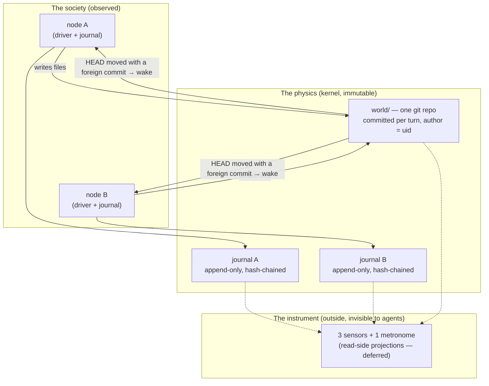
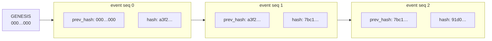
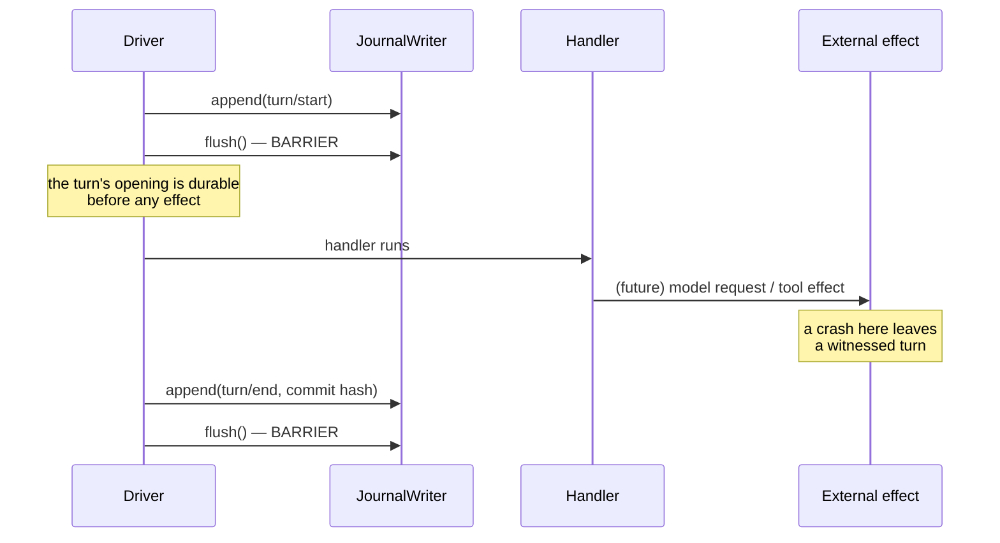
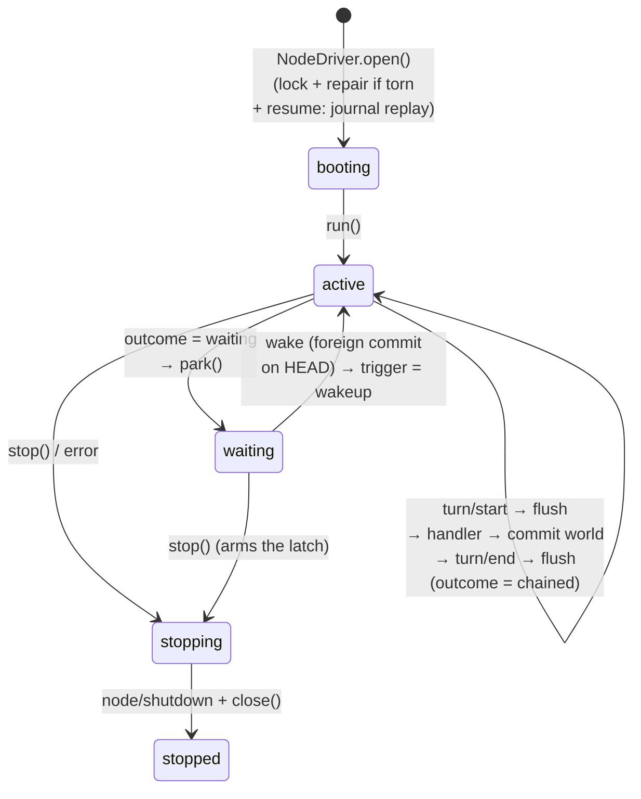
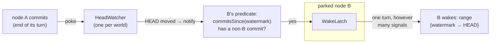

# Architecture — how the system works, from the top

This document is the **map between the concepts and the code**. It is the entry point for anyone who wants to understand how the software actually works before reading it: what the pieces are, how they relate, and where each concept of the design lives in the implementation. It stays deliberately **macro** — the micro level (every parameter, every error path) is the codebase's job, and the code is written to be read.

The rest of the corpus answers different questions: [vision.md](vision.md) says *why* the project exists and *what* it demonstrates; [seed.md](seed.md) and [direction.md](direction.md) specify the cold start and the co-negotiated direction; [kernel.md](kernel.md) is the authoritative technical spec, written *before* the code, with the rejected alternatives; [research/](research/) holds the evidence base; the per-checkpoint construction plans live in `docs/plans/` — a local, git-ignored working directory that is intentionally not published. This document is the one that goes **from the running code back up to the concepts** — it is maintained at each checkpoint closure, because the code is hardened beyond what the plans sketched, and the plans are journals, not maps.

Scope as of today: **C1.1 (the journal) and C1.2 (the node driver) are implemented and tested.** Everything beyond them is drawn here in dotted lines, as specified but not yet built. There is no CLI, main process or running product yet — the implemented surface is the library source, not a launchable kernel.

---

## 1. The system in one picture

A perpetual society of LLM agents, observed. Three mechanisms carry the whole design:

1. **The journal is the only truth** — every act of every node is an event in an append-only, hash-chained log; everything else is a disposable projection.
2. **The world is the filesystem** — one git repository; nodes communicate only by writing files; the kernel commits the world at the end of every turn with the node's uid as git author.
3. **Wake-on-change** — the kernel watches the world's git HEAD; a node wakes when HEAD carries a commit it did not author. A static world spends no tokens.



The suture between the two records: **`turn/end` carries the git commit hash** the turn produced. For any journal `seq` the exact world state is known; for any commit the turn that produced it is known. Neither record alone suffices; together they are what makes metrology possible.

---

## 2. The full component map

```mermaid
flowchart TB
    subgraph FUTUR["C1.3+ — specified, not yet implemented"]
        ASM["context assembler<br/>(perception = diff, byte-stable prefix)"]
        LLM["provider adapter<br/>(the only network path)"]
        TOOLS["tools: execute / speak / web / extend"]
        AZ["agent zero + human chat"]
    end

    subgraph NODE["src/node/ — a node's engine (C1.2)"]
        DRIVER["driver.ts — NodeDriver<br/>turn ritual, watermark,<br/>resume, park/wake, shutdown"]
        WORLD["world.ts — WorldRepo<br/>the world as a git repo,<br/>commit per turn (author = uid)"]
        WATCH["watcher.ts — HeadWatcher<br/>watches git HEAD,<br/>poke + interval"]
        LATCH["latch.ts — WakeLatch<br/>in-memory wake signal<br/>(coalescing)"]
        EVENTS["events.ts — vocabulary:<br/>node/boot, node/shutdown,<br/>turn/start, turn/end"]
    end

    subgraph JOURNAL["src/journal/ — the single truth (C1.1)"]
        subgraph PUR["Pure core (zero I/O)"]
            ENV["envelope.ts<br/>event format + hash chain"]
            CANON["canon.ts<br/>RFC 8785 + SHA-256"]
        end
        subgraph STORE["Storage"]
            FRAME["framing.ts<br/>zstd frames,<br/>torn/corrupt scan"]
            BLOB["blobs.ts — BlobStore<br/>claim-check"]
            LOCK["lock.ts<br/>single-writer lock<br/>{pid, startedAt}"]
            FSU["fsutil.ts<br/>fsync, atomicWriteFile, writeAll"]
            LAY["layout.ts<br/>paths + Head shape"]
        end
        subgraph ACTORS["Actors"]
            WRITER["writer.ts — JournalWriter<br/>append, 200 ms timer,<br/>flush barrier, watermark,<br/>rollback, poison"]
            READER["reader.ts — JournalReader<br/>+ repair()"]
            VERIFY["verify.ts — verifyChain<br/>5 rules, shared<br/>reader ↔ writer"]
        end
    end

    subgraph DISK["cell-home/ (the disk)"]
        LOG["journal.v0.jsonl.zstd<br/>(CANONICAL — per node)"]
        HEAD["journal.v0.head (disposable)"]
        LCK["journal.v0.lock (disposable)"]
        BLOBS["blobs/<2 hex>/<sha256><br/>(shared across nodes)"]
        GIT["world/ — git repo + HEAD"]
    end

    DRIVER -->|"append turn/start, turn/end<br/>+ flush() barrier"| WRITER
    DRIVER --> EVENTS
    DRIVER -->|"commitAll(uid) every turn"| WORLD
    DRIVER -->|"subscribe / poke"| WATCH
    DRIVER -->|"wait() while parked"| LATCH
    WATCH --> GIT
    WORLD --> GIT
    WRITER --> ENV & CANON
    WRITER --> FRAME & BLOB & LOCK & FSU
    WRITER -->|"write + fsync"| LOG
    WRITER -->|"atomicWriteFile"| HEAD
    WRITER -->|"put (before the flush)"| BLOBS
    LOCK --> LCK
    READER --> VERIFY & FRAME
    READER -->|"get (resolveBlobs)"| BLOBS
    VERIFY --> ENV
    WRITER -.->|"resume() verifies the chain"| VERIFY
    READER -->|"repair() truncates"| LOG
    ASM -.-> DRIVER
    LLM -.->|"flush() before every request"| WRITER
    TOOLS -.->|"cross the mutation gate"| WRITER
```



How to read this map:

- **The driver is the writer's only client.** The handler (the future assembler/LLM side) gets a narrow `TurnContext` — no journal, no commit. That is the guarantee that *only the kernel emits*.
- **The driver also owns the world**: every turn ends in a commit → HEAD moves → the shared watcher (one per world) announces the movement → each parked node evaluates *its own* predicate (a commit I did not author?) → its latch wakes it.
- **`verify.ts` is the meeting point** between write and read: the writer's `resume()` replays exactly the rules the reader applies — a log valid for one is valid for the other.
- **On disk, the canonical records are the journal, the payload blobs it references, and the world's git history**: `journal.v0.jsonl.zstd` plus `blobs/…`. The head, the lock, the SQLite index and the projection snapshots are disposable; the blob store is not — it carries the original payloads the log only references, and is shared across nodes (content addressing makes that safe). The world's git history is the second truth, joined to the journal by the commit hash in `turn/end`.

---

## 3. The journal: provable truth

### 3.1 The hash chain

Every event is an envelope with a frozen field set: `{v, type, seq, time, prev_hash, hash, ignorable?, data}`. The chain rule (`envelope.ts:57`):

```
hash(n) = SHA-256( hash(n-1) + canon({v, type, seq, time, [ignorable], data}) )
```

Two ingredients make this meaningful:

- **Canonicalization (RFC 8785 / JCS, `canon.ts`)** — hashing runs on bytes, and logically-equal JSON can serialize many ways (key order, number forms). JCS imposes one byte representation per value; anything that cannot serialize losslessly (`undefined`, `NaN`, cycles…) is *refused*. Without it, a hash could not distinguish "altered" from "rewritten in another key order".
- **The prev_hash link** — each event embeds its predecessor's hash, starting from `GENESIS_HASH` (64 zeros). So `hash(n)` is indirectly a fingerprint of the whole history up to `n`: the chain's last hash summarizes the entire journal.



Why tampering cannot hide: modify one byte of an old event and its recomputed hash changes (avalanche); the next event's `prev_hash` no longer matches; fixing that requires rewriting the event, which breaks the next link, and so on to the tip. **Append-only by construction**: rewriting the past requires rewriting the whole future — and the tip hash cited anywhere else will not match.

Verification (`verify.ts`) replays from genesis and applies five rules to every event: frozen field set and well-formed hashes; `v === 0`; **contiguous `seq`** (a deletion leaves no broken hash but a visible hole — completeness is checked by numbering, not by hashing); `prev_hash` linkage; hash recomputation. The walk never skips the beginning, even when the caller only wants a suffix.

This is closer to **git than to a blockchain**: one writer per journal (enforced by the lock), a chain per node (a global chain would serialize all writers), and detection rather than economic prevention.

### 3.2 Persistence: fast writes that survive crashes

Two constraints fight each other: `fsync` costs too much to run per event, yet "model-visible means logged" forbids any external effect without a durable trace. Three mechanisms reconcile them.

**Frames.** The log file is a concatenation of independent, length-prefixed, checksummed zstd frames. One frame = one batch = one `write` + one `fsync` — the unit of durability. Appending never touches existing bytes (the file is opened in `'a'` mode), and the length prefix lets a reader walk frames without decompressing the whole file.

**Write-behind.** `append()` is synchronous and in-memory: hash, capture the canonical line, push to `pending`, return. The *first* event of a burst starts a 200 ms timer (no debounce — the window never resets); when it elapses, the whole burst is written as one frame, one fsync. The hot path never blocks on I/O, and a failed write restores the batch for retry instead of dropping it.

**The flush barrier.** Before every model request and every top-level tool effect, the caller invokes `flush()` — durability *before* effect. The driver flushes at `turn/start` (before the handler can act) and at `turn/end` (before the loop unwinds, because the closer carries the world commit hash: an orphan commit would be an effect without a trace).



**Watermark, rollback, poison.** The writer tracks both the in-memory tip (`seq`, `prevHash`) and the durable watermark (`committed.bytes/seq/lastHash`). A failed write restores the batch *and* truncates the log back to the watermark so the retry is clean. Two consecutive failures — or a failed rollback — **poison** the writer: every later append/flush/close is refused. Retrying over a partial frame would bury the tear mid-log and hide every later event; a typed terminal state beats a journal that silently lies.

**Crash repair: torn tail vs interior corruption.** A crash mid-write leaves a final fragment. `scanBatches` reads its length prefix: the announced frame overruns EOF — but is that a partial write or a flipped length bit? The discriminator is the payload: every zstd frame starts with the magic `28 B5 2F FD`.

```mermaid
flowchart TD
    P["prefix announces N bytes<br/>but EOF comes first"] --> M{"do the present bytes<br/>start with the zstd magic?"}
    M -->|no| T["TORN TAIL<br/>not even a frame start<br/>→ repair() may discard"]
    M -->|yes| D{"does the available payload<br/>decode fully?"}
    D -->|yes| C["INTERIOR CORRUPTION<br/>a whole frame existed, only the prefix lied<br/>→ CorruptFrameError — never truncate"]
    D -->|no (strict prefix of a frame)| T2["TORN TAIL<br/>genuine partial write<br/>→ repair() may discard"]
```

`repair()` — the system's only destructive path — truncates at the last valid frame, fsyncs file and directory, and deletes the stale head. Events lost this way were never durable, so nothing durable references them; an interrupted *turn* is a different matter — its durable events stay, and resume appends a synthetic `interrupted` closer. Interior corruption is never truncated: it would throw away valid events behind the damage. Symmetrically, the writer *refuses to open* a torn log (`TornTailError`); the driver catches it at boot, runs `repair()`, and reopens.

The module's philosophy, everywhere: **refuse rather than guess** — unknown version, unknown non-ignorable type, truncated blob, corruption, repeated write failure all end in typed terminal states, never in "carry on and hope".

### 3.3 Claim-check blobs

A payload at or past 16 KiB of canonical bytes leaves the log: the event's `data` becomes a reference `{blob, size}` (plus `truncated: true` past 4 MiB — the loss is explicit), and the canonical bytes go to the blob store. The chain hashes the *reference*, so verification of the log never needs the content; resolution happens afterwards, only when a reader asks (`resolveBlobs`). The chain's hash therefore covers the reference, **not the blob's bytes**: the current reader resolves a blob without re-hashing it. Automatic digest-and-size verification of every resolved blob is planned for C1.3's verified loader, not implemented today.

The store is plain files under `blobs/<2 hex>/<sha256>`, **shared across all nodes**:

- **Content addressing** — the file name *is* the content's SHA-256: deduplication is free (a repeated payload is stored once), a blob's integrity is checkable by re-hashing against the name, and sharing across nodes is safe. The write path is content-addressed; the current read path does not perform that check automatically, which is why C1.3 adds a verified loader.
- **Atomic writes** — temp file, fsync, rename: a crash cannot leave a torn blob under a trusted name.
- **Blobs before events** — the flush drains pending blobs *before* writing the frame that references them; a blob failure counts in the same poison streak as a log failure.

---

## 4. The node driver: a node's breathing loop

Three files collaborate: `driver.ts` (orchestration), `world.ts` (the git world), `watcher.ts` (the HEAD signal).

### 4.1 The turn ritual



Each turn: open on the world range `{from: watermark, to: HEAD}`, journal `turn/start` and flush, call the handler with a narrow `TurnContext` (`{turn, trigger, world, now}` — no journal, no commit), commit the world with the node's uid as author, journal `turn/end` with the commit hash and flush, then either chain a further turn or park.

Four event types only: `node/boot`, `node/shutdown`, `turn/start`, `turn/end`. A crash is the *absence* of `node/shutdown`; an interrupted turn is closed at resume by a **synthetic** `turn/end {outcome: 'interrupted'}` after its leftover writes are committed under the node's authorship — an effect is never left unattributed.

**The empty turn.** A turn with no tool call and no world change is still a turn — journaled, committing nothing. Its closer carries the envelope's `ignorable` mark: emptiness is knowable only once the turn has ended, so the closer is the skip unit. A reader that does not model empty turns may skip them; the metrology sees them — a run of empty turns is the "polite waiting" failure mode, visible nowhere else.

### 4.2 Wake-on-change

The watcher monitors the world's git **HEAD**, not the filesystem: no inotify, no partial-write races, nothing to debounce — HEAD moves exactly once per turn, at a kernel-controlled point. It announces *movement*, not *waking*: deciding whether a movement concerns a given node is that node's predicate. Its first read announces the HEAD it finds (including an unborn HEAD) to set a baseline; later reads announce only a change.



Consequences that are all load-bearing: a static world produces no wakes and spends no tokens; a dialogue is alternating commits; a node's own commits never wake it (self-excitation by writing is impossible); wakes coalesce at three levels (the latch, the watcher's pokes, the `commitsSince` range). The `poke` path gives in-process dialogues minimal latency; an interval catches out-of-process commits (the human's, another kernel's). Read failures on the wake path *delay* a wake, never kill the node; durability failures (commit, flush) are fatal — a missed question costs a turn, a lost answer costs a fact.

**The watermark** is the node's perception cursor: the HEAD its last turn opened on — rebuilt from the journal at resume, never from the current HEAD, so a node that slept through changes wakes on what it missed. It advances at turn *opening*: what a turn perceives is frozen when it opens, and a foreign commit landing mid-turn belongs to the next turn.

### 4.3 The world as a git repo

`world.ts` drives the git CLI (auditable byte for byte) with the node's uid as both author and committer identity. Commits are serialized twice: an in-process queue per world (two drivers must never interleave `add`/`commit`), and bounded retries on git's index lock (external writers exist — the human). `ownCommit` ensures the hash journaled in `turn/end` names a commit *this node wrote*: with one shared working tree, a turn-end commit can carry a peer's in-flight writes — attribution is commit-granular, and per-file truth stays in the journal. Hard guards refuse an unsafe world path (`$HOME`, `/`, a symlink resolving to one — the 200 GB lesson).

---

## 5. Mechanism and policy: the frontier the agents cannot cross

The design's load-bearing boundary (`kernel.md` §1.6, §5.5):

| | Lives in | Mutable by the organism? |
|---|---|---|
| **Mechanism (physics)** — journal + hash chain, mutation gate, watcher, commit-per-turn, turn ritual, kill switch, sandbox, budget ceiling | the kernel | **No** — an organism that could rewrite these could rewrite the measurement apparatus |
| **Policy (phenotype)** — when to wake, what enters the context, what is retained, loop/compaction policies, tools, instincts | behavior Packages (C1.5) | **Yes** — via `extend`, and every policy change is itself a journaled decision |

Everything already implemented is mechanism. The first policy arrives with C1.3: the assembler decides what the wake's diff presents, but that policy lands in trusted kernel-side handlers, not yet as a replaceable behavior Package. Organism replaceability — loop, context and compaction policies shipping as Packages through `extend` — arrives with C1.5; until then every policy change is a journaled kernel-side decision, not an organism-rewritable one.

---

## 6. What exists, what comes next

Implemented and tested:

- **C1.1 — the journal** (`src/journal/`): envelope + hash chain, RFC 8785 canonicalization, zstd frames, claim-check blobs, single-writer lock, write-behind with flush barrier, watermark/rollback/poison, verifying reader, torn-tail repair.
- **C1.2 — the node driver** (`src/node/`): turn ritual, commit-per-turn with uid authorship, wake-on-change over HEAD, free loop with explicit unbounded wait, empty turns, resume with synthetic closers.

Next, in the order of `kernel.md` §10:

- **C1.3** — context assembler (perception = the world's diff since last wake; byte-stable prefix `[tools, charter, heading]` for provider cache; empty-turn exclusion; pinned heading and compaction over durable surface groups; full-history fold and recovery) + provider adapter (raw response journaled before projection; one canonical, non-streaming wire) + raw shell tool (experimental and not yet confined — C1.4 adds Landlock/PTY) + disposable snapshot storage (no snapshot-accelerated boot yet). The gate and its verified claim-check loader are trusted kernel-side code, not a replaceable Package.
- **C1.4** — tools: `execute` (persistent PTY under a Landlock sandbox — the API key physically unreadable from the agent's shell), `speak`, `web_search`/`web_fetch`, and the **credential broker** (named providers held kernel-side, endpoint-bound placeholders substituted at the gate — third-party APIs without any secret entering the world).
- **C1.5** — `extend`: Plugin → immutable Packages → Runs, persisted by journal replay, executed in `node:vm` behind a restricted facade.
- **C1.6** — agent zero (root custody node, sole holder of the human channel, direction drafting) + chat + the disposable SQLite index and projections.
- **C1.7** — reconstructability invariant at boot + escalating kill switch.
- **Then** — the monitoring session: the 3 sensors (semantic trajectory, structure graph, value registry) + the metronome (versioned direction), read-side projections feeding the cockpit. Specified in [research/monitoring-architecture.md](research/monitoring-architecture.md).

---

## 7. Concept ↔ code map

| Concept | Where it lives |
|---|---|
| "The journal is the only truth" | all of `src/journal/`; head, lock, SQLite index and snapshots disposable — the hash-chained log and the payload blobs it references are the canonical record |
| Append-only / hash chain | `src/journal/envelope.ts` (`computeHash`, `makeEvent`, `verifyEvent`) |
| Canonical bytes | `src/journal/canon.ts` (RFC 8785, refuse lossy values) |
| "Model-visible means logged" | `flush()` barrier in `writer.ts`, called at `turn/start`/`turn/end` in `driver.ts` |
| Durability batching | `framing.ts` (frames) + the 200 ms timer in `writer.ts` |
| Never lose an event silently | watermark + rollback + poison in `writer.ts` |
| Crash repair | `repair()` in `reader.ts` + the magic-number test in `framing.ts` |
| Claim-check | `blobs.ts` + `claimCheck` in `writer.ts` + `resolveData` in `reader.ts` |
| One writer per journal | `lock.ts` (`{pid, startedAt}`) |
| The world is the filesystem | `src/node/world.ts` (git CLI, author = uid) |
| Wake-on-change | `src/node/watcher.ts` + the `wakeNeeded` predicate in `driver.ts` |
| Perception is a diff | `watermark` in `driver.ts` + `commitsSince` in `world.ts` (the C1.3 assembler will consume it) |
| Empty turn as a signal | `ignorable: true` on `turn/end` (`driver.ts`) |
| An effect is never unattributed | synthetic closers at resume (`driver.ts`), `ownCommit` (`world.ts`) |
| Only the kernel emits | the narrow `TurnContext` (`driver.ts`) |
| The two records joined | the commit hash in `turn/end` |

---

*Maintenance rule: this map is updated when a checkpoint closes, alongside its plan. A checkpoint is not reached until this document shows it.*
