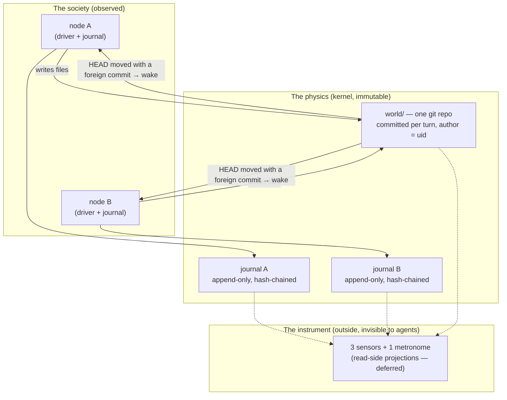
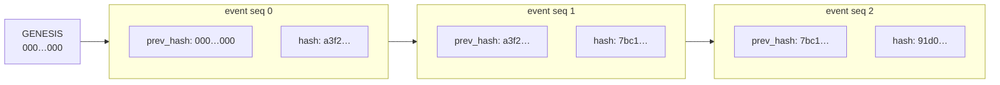
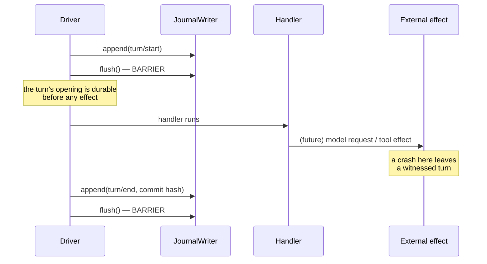
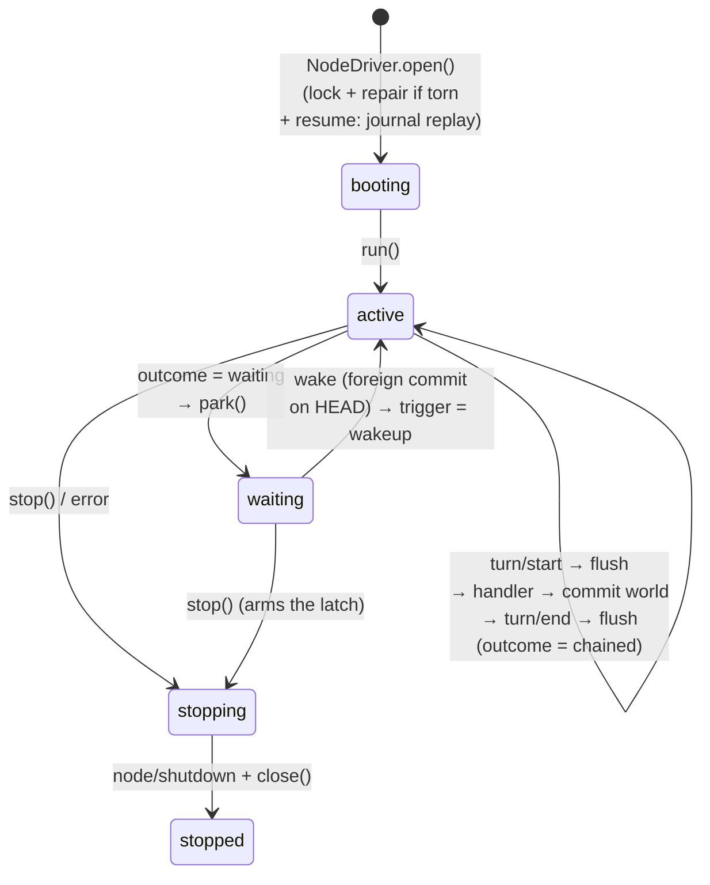
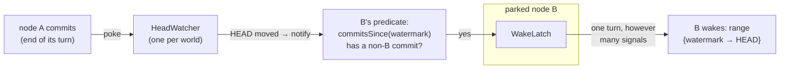

# Architecture — how the system works, from the top

This document is the **map between the concepts and the code**. It is the entry point for anyone who wants to understand how the software actually works before reading it: what the pieces are, how they relate, and where each concept of the design lives in the implementation. It stays deliberately **macro** — the micro level (every parameter, every error path) is the codebase's job, and the code is written to be read.

The rest of the corpus answers different questions: [vision.md](vision.md) says *why* the project exists and *what* it demonstrates; [seed.md](seed.md) and [direction.md](direction.md) specify the cold start and the co-negotiated direction; [kernel.md](kernel.md) is the authoritative technical spec, written *before* the code, with the rejected alternatives; [research/](research/) holds the evidence base; the per-checkpoint construction plans live in `docs/plans/` — a local, git-ignored working directory that is intentionally not published. This document is the one that goes **from the running code back up to the concepts** — it is maintained at each checkpoint closure, because the code is hardened beyond what the plans sketched, and the plans are journals, not maps.

Scope as of today: **C1.1 (the journal), C1.2 (the node driver) and C1.3 (the durable context and provider boundary) are implemented and tested.** So are the C1.3 pieces a future host will drive: the context assembler, the fold, the committed surface, compaction, the bounded Git perception, one canonical provider wire with its adapter and transport, the foreground raw shell tool, and disposable projection snapshots. Everything beyond them is drawn here in dotted lines, as specified but not yet built: the confinement of `execute` (Landlock/PTY) and the credential broker (C1.4), the Package layer (C1.5), agent zero, chat and the disposable SQLite index (C1.6), and the boot-time invariant and kill switch (C1.7). There is no CLI, main process or running product yet — the implemented surface is the library source plus the runtime a future host would drive, not a launchable kernel.

---

## 1. The system in one picture

A perpetual society of LLM agents, observed. Three mechanisms carry the whole design:

1. **The journal is the only truth** — every mediated act of every node is an event in an append-only, hash-chained log; everything else is a disposable projection. What is recorded is the boundary fact, not an exhaustive trace: the top-level tool invocation and its result, the model response, and the observed world diff — raw shell syscalls inside a turn are not individually logged.
2. **The world is the filesystem** — one git repository; nodes communicate only by writing files; the kernel commits the world at the end of every turn with the node's uid as git author.
3. **Wake-on-change** — the kernel watches the world's git HEAD; a node wakes when HEAD carries a commit it did not author. A static world spends no tokens.



The suture between the two records: **`turn/end` carries the git commit hash** the turn produced. The join is at *recorded turn boundaries* and is commit-granular, not per-file: at each recorded `turn/end` the commit that closed the turn is known and the perception is pinned to its recorded range, but an arbitrary `seq` is not an exact world snapshot — a shell write mid-turn, or a commit made outside any journal turn, has no per-`seq` mapping. Neither record alone suffices; together they are what makes metrology possible (see §4.3 for attribution and interrupted-turn reconciliation).

---

## 2. The full component map

```mermaid
flowchart TB
    subgraph LOOPBOX["src/node/loop.ts — the C1.3 runtime (implemented)"]
        LOOP["createAgentRuntime<br/>the trusted handler + hook bundle:<br/>fold, world perception, assembly,<br/>compaction, call dispatch, checkpoints"]
    end

    subgraph CTX["src/context/ — durable context (C1.3)"]
        CFG["config.ts — default config<br/>+ strict validation"]
        EV["events.ts — the boundary<br/>event vocabulary"]
        ART["artifacts.ts — canonical<br/>bytes + artifact resolution"]
        LOADER["loader.ts — the verified<br/>claim-check read"]
        FOLD["fold.ts — ContextFold:<br/>config, surface, open turn, recovery"]
        SURF["surface.ts — committed surface<br/>+ transactional compaction"]
        COMP["compaction.ts / groups.ts —<br/>policy + neutral group rules"]
        DIFF["diff.ts — presentWorld:<br/>bounded pinned Git perception"]
        ASM["assembler.ts — assemble():<br/>the one canonical plan"]
        SNAP["snapshots.ts — disposable<br/>projection checkpoints"]
    end

    subgraph PROVIDER["src/provider/ — the only kernel-mediated provider path (C1.3)"]
        WIRE["wire.ts — serializeWire:<br/>canonical non-streaming body"]
        ADAPTER["adapter.ts — ProviderAdapter:<br/>plan → wire → raw before projection"]
        TRANSPORT["transport.ts — OpenAITransport:<br/>exact bytes, bounded body"]
        USAGE["usage.ts — normalizeUsage"]
    end

    subgraph TOOLS["src/node/tools/ — foreground tools (C1.3)"]
        SHELL["shell.ts — runShell:<br/>process group + env allowlist"]
        DISPATCH["dispatch.ts — dispatchCalls:<br/>complete tool dialogues"]
    end

    subgraph NODE["src/node/ — a node's engine (C1.2 + gate)"]
        DRIVER["driver.ts — NodeDriver<br/>turn ritual, watermark,<br/>resume, park/wake, shutdown"]
        GATE["gate.ts — the trusted gate<br/>chunking, manifests, barrier"]
        WORLD["world.ts — WorldRepo<br/>the world as a git repo,<br/>commit per turn (author = uid)"]
        WATCH["watcher.ts — HeadWatcher<br/>watches git HEAD,<br/>poke + interval"]
        LATCH["latch.ts — WakeLatch<br/>in-memory wake signal<br/>(coalescing)"]
        EVENTS["events.ts — node vocabulary:<br/>node/boot, node/shutdown,<br/>turn/start, turn/end"]
    end

    subgraph JOURNAL["src/journal/ — the single truth (C1.1)"]
        subgraph PUR["Pure core (zero I/O)"]
            ENV["envelope.ts<br/>event format + hash chain"]
            CANON["canon.ts<br/>RFC 8785 + SHA-256"]
        end
        subgraph STORE["Storage"]
            FRAME["framing.ts<br/>zstd frames,<br/>torn/corrupt scan"]
            BLOB["blobs.ts — BlobStore<br/>claim-check"]
            LOCK["lock.ts — single-writer lock<br/>flock guard + owner record"]
            FSU["fsutil.ts<br/>fsync, atomicWriteFile, writeAll"]
            LAY["layout.ts<br/>paths + Head shape"]
        end
        subgraph ACTORS["Actors"]
            WRITER["writer.ts — JournalWriter<br/>append, 200 ms timer,<br/>flush barrier, watermark,<br/>rollback, poison"]
            READER["reader.ts — JournalReader<br/>+ repair()"]
            VERIFY["verify.ts — verifyChain<br/>shared reader ↔ writer"]
        end
    end

    subgraph FUTUR["C1.4+ — specified, not yet implemented"]
        TOOLSX["execute (Landlock + PTY) / speak / web / extend"]
        AZ["agent zero + human chat + SQLite index"]
    end

    subgraph DISK["cell-home/ (the disk)"]
        LOG["journal.v0.jsonl.zstd<br/>(CANONICAL — per node)"]
        HEAD["journal.v0.head (disposable)"]
        LCK["journal.v0.lock (flock sidecar)"]
        OWN["journal.v0.owner<br/>durable {pid, startedAt, token}"]
        BLOBS["blobs/<2 hex>/<sha256><br/>(shared across nodes)"]
        GIT["world/ — git repo + HEAD"]
        SNAPD["nodes/&lt;uid&gt;/snapshots/&lt;seq&gt;.json<br/>(disposable, retention 2)"]
    end

    DRIVER -->|"append turn/start, turn/end<br/>+ flush() barrier"| WRITER
    DRIVER --> EVENTS
    DRIVER --> GATE
    DRIVER -->|"commitAll(uid) every turn"| WORLD
    DRIVER -->|"subscribe / poke"| WATCH
    DRIVER -->|"wait() while parked"| LATCH
    WATCH --> GIT
    WORLD --> GIT
    WRITER --> ENV & CANON
    WRITER --> FRAME & BLOB & LOCK & FSU
    WRITER -->|"write + fsync"| LOG
    WRITER -->|"atomicWriteFile"| HEAD
    WRITER -->|"put (before the flush)"| BLOBS
    LOCK --> LCK
    LOCK --> OWN
    READER --> VERIFY & FRAME
    READER -->|"get (resolveBlobs)"| BLOBS
    VERIFY --> ENV
    WRITER -.->|"resume() verifies the chain"| VERIFY
    READER -->|"repair() truncates"| LOG
    LOOP --> FOLD & ASM & COMP & DIFF & SNAP & DISPATCH
    LOOP -->|"gate.store / gate.capture"| GATE
    LOOP -->|"adapter.send(plan)"| ADAPTER
    ADAPTER --> WIRE
    ADAPTER -->|"raw body captured and flushed<br/>before decode"| GATE
    ADAPTER --> TRANSPORT
    ADAPTER --> USAGE
    TRANSPORT -->|"POST exact bytes"| NET(["provider endpoint"])
    DISPATCH --> SHELL
    DISPATCH -->|"tool/call, tool/result, raw artifact"| GATE
    SURF --> ASM
    COMP --> SURF
    FOLD --> SURF
    DIFF --> WORLD
    SNAP --> SNAPD
    ART --> LOADER & FOLD
    EV --> GATE & FOLD
    CFG --> FOLD
    ADAPTER -.->|"flush() before every request"| WRITER
    TOOLSX -.->|"cross the mutation gate"| WRITER
    AZ -.-> LOOP
```



How to read this map:

- **The driver is the writer's only client.** The runtime (and any trusted C1.3 handler) gets a narrow `TurnContext` — no journal, no commit, only the boundary gate. That is the guarantee that *only the kernel emits*.
- **Replay refuses an incomplete vocabulary before it takes the writer.** With hooks, the driver checks the whole contract up front: `readHistory`, `readBlob` and `acknowledgedWorld` must all be present, and the `knownTypes` set must cover both the node lifecycle types and every type in the registry — a set missing either is refused explicitly and early, rather than surfacing later as an unknown-event replay failure.
- **The provider path is the only *mediated* one.** `src/provider/` is the only kernel-mediated LLM provider transport — the raw shell is not confined and can open its own sockets, so this is not an exclusive network claim; the C1.4 credential broker and its egress policy remain open.
- **The gate is the runtime's effect boundary.** `src/node/gate.ts` owns chunking, artifact manifests and the claim-check inline threshold, so a handler never touches the writer; its `flush()` is a durable barrier that re-reads and digest/size-verifies every pending claim-check before the effect is allowed.
- **The driver also owns the world**: every turn ends in a commit → HEAD moves → the shared watcher (one per world) announces the movement → each parked node evaluates *its own* predicate (a commit I did not author?) → its latch wakes it.
- **The C1.3 runtime is the trusted handler.** `createAgentRuntime` folds the journal, presents one bounded world perception per turn, assembles exactly one plan per logical request, sends it through the adapter, and dispatches the resulting tool calls. It never hands the writer to the model and never invents a second message, request, artifact or state shape.
- **`verify.ts` is the meeting point** between write and read: the writer's `resume()` replays exactly the rules the reader applies — a log valid for one is valid for the other.
- **On disk, the canonical records are the journal, the payload blobs it references, and the world's git history**: `journal.v0.jsonl.zstd` plus `blobs/…`. The head, the lock and owner sidecars, the SQLite index and the projection snapshots are disposable; the blob store is not — it carries the original payloads the log only references, and is shared across nodes (content addressing makes that safe). The world's git history is the second truth, joined to the journal by the commit hash in `turn/end`.

---

## 3. The journal: provable truth

### 3.1 The hash chain

Every event is an envelope with a frozen field set: `{v, type, seq, time, prev_hash, hash, ignorable?, data}`. The chain rule (`envelope.ts:57`):

```
hash(n) = SHA-256( hash(n-1) + canon({v, type, seq, time, [ignorable], data}) )
```

Two ingredients make this meaningful:

- **Canonicalization (RFC 8785 / JCS, `canon.ts`)** — hashing runs on bytes, and logically-equal JSON can serialize many ways (key order, number forms). JCS imposes one byte representation per value; anything that cannot serialize losslessly (`undefined`, `NaN`, cycles…) is *refused*. Without it, a hash could not distinguish "altered" from "rewritten in another key order". This is a **data-only contract at a trusted boundary, not a non-bypassable one**: only own enumerable data properties of plain objects and full arrays are read, no accessor and no `toJSON` hook (own or inherited) is ever *called* — a callable or accessor `toJSON` is refused instead — and a key literally named `__proto__` is preserved as an ordinary own data property rather than routed through a prototype setter. An exotic object (a `Proxy`) that misreports its own descriptors is explicitly out of scope.
- **The prev_hash link** — each event embeds its predecessor's hash, starting from `GENESIS_HASH` (64 zeros). So `hash(n)` is indirectly a fingerprint of the whole history up to `n`: the chain's last hash summarizes the entire journal.



Why tampering cannot hide: modify one byte of an old event and its recomputed hash changes (avalanche); the next event's `prev_hash` no longer matches; fixing that requires rewriting the event, which breaks the next link, and so on to the tip. **Append-only by construction**: rewriting the past requires rewriting the whole future — and the tip hash cited anywhere else will not match.

Verification (`verify.ts`) replays from genesis and applies five rules to every event: frozen field set and well-formed hashes; `v === 0`; **contiguous `seq`** (a deletion leaves no broken hash but a visible hole — completeness is checked by numbering, not by hashing); `prev_hash` linkage; hash recomputation. The walk never skips the beginning, even when the caller only wants a suffix.

This is closer to **git than to a blockchain**: one writer per journal (enforced by the lock), a chain per node (a global chain would serialize all writers), and detection rather than economic prevention.

### 3.2 Persistence: fast writes that survive crashes

Two constraints fight each other: `fsync` costs too much to run per event, yet "model-visible means logged" forbids any external effect without a durable trace. Three mechanisms reconcile them.

**Frames.** The log file is a concatenation of independent, length-prefixed, checksummed zstd frames. One frame = one batch = one `write` + one `fsync` — the unit of durability. Appending never touches existing bytes (the file is opened in `'a'` mode), and the length prefix lets a reader walk frames without decompressing the whole file.

**Write-behind.** `append()` is synchronous and in-memory: hash, capture the canonical line, push to `pending`, return. The *first* event of a burst starts a 200 ms timer (no debounce — the window never resets); when it elapses, the whole burst is written as one frame, one fsync. The hot path never blocks on I/O, and a failed write restores the batch for retry instead of dropping it.

**The flush barrier.** Before every model request and every top-level tool effect, the caller invokes `flush()` — durability *before* effect. The driver flushes at `turn/start` (before the handler can act) and at `turn/end` (before the loop unwinds, because the closer carries the world commit hash: an orphan commit would be an effect without a trace).



**Watermark, rollback, poison.** The writer tracks both the in-memory tip (`seq`, `prevHash`) and the durable watermark (`committed.bytes/seq/lastHash`). A failed write restores the batch *and* truncates the log back to the watermark so the retry is clean. Two consecutive failures — or a failed rollback — **poison** the writer: every later append/flush/close is refused. Retrying over a partial frame would bury the tear mid-log and hide every later event; a typed terminal state beats a journal that silently lies.

**Ownership.** A stable flock sidecar (`journal.v0.lock`) serializes every lifecycle transition, while the exclusive right itself is a separate durable record (`journal.v0.owner`) naming the owner process `{pid, startedAt, token}`. The read-decide-write of that record runs in a short-lived helper process launched by `flock -F` — no fork, no persistent lease process — so a partially written record is impossible and a crashed helper releases the kernel lock by itself, while a dead owner's record is reclaimed under the guard. Release is token-bound (it clears only the record it created, never a later owner's) and a genuinely unknown guard outcome triggers a token-conditional cleanup; repair likewise runs under the exclusive guard. The mechanism requires Linux util-linux `/usr/bin/flock` and `/proc` (pid start times), and is not a shared-disk (NFS/multi-host) protocol.

**Durable directories.** Before a log batch or a blob reference can be durable, its directory entry must be: `ensureDurableDirectory` creates each missing level from a trusted root — the cell home, which the caller owns — and fsyncs each level's parent top-down, re-proving the whole chain on every call rather than caching a pathname. The fsync chain stops *below* the cell home; a missing home is created and proven up to its first existing ancestor. Head failures are the deliberate exception: the head checkpoint is written only after the batch it describes is durable, so a head write that fails is reported as a diagnostic (the writer's `onError`) and the flush still succeeds — losing the head costs a rebuild, never the committed log, and a head failure never poisons the writer.

**Crash repair: torn tail vs interior corruption.** A crash mid-write leaves a final fragment. `scanBatches` reads its length prefix: the announced frame overruns EOF — but is that a partial write or a flipped length bit? The discriminator is the payload: every zstd frame starts with the magic `28 B5 2F FD`.

```mermaid
flowchart TD
    P["prefix announces N bytes<br/>but EOF comes first"] --> M{"do the present bytes<br/>start with the zstd magic?"}
    M -->|no| T["TORN TAIL<br/>not even a frame start<br/>→ repair() may discard"]
    M -->|yes| D{"does the available payload<br/>decode fully?"}
    D -->|yes| C["INTERIOR CORRUPTION<br/>a whole frame existed, only the prefix lied<br/>→ CorruptFrameError — never truncate"]
    D -->|no (strict prefix of a frame)| T2["TORN TAIL<br/>genuine partial write<br/>→ repair() may discard"]
```

`repair()` — the system's only destructive path — truncates at the last valid frame, fsyncs file and directory, and deletes the stale head. Events lost this way were never durable, so nothing durable references them; an interrupted *turn* is a different matter — its durable events stay, and resume appends a synthetic `interrupted` closer. Interior corruption is never truncated: it would throw away valid events behind the damage. Symmetrically, the writer *refuses to open* a torn log (`TornTailError`); the driver catches it at boot, runs `repair()`, and reopens.

The module's philosophy, everywhere: **refuse rather than guess** — unknown version, unknown non-ignorable type, truncated blob, corruption, repeated write failure all end in typed terminal states, never in "carry on and hope".

### 3.3 Claim-check blobs

A payload whose canonical UTF-8 byte length is **at or past 16 KiB** (`CLAIM_CHECK_THRESHOLD`) leaves the log: the event's `data` becomes a reference `{blob, size}`, and the canonical bytes go to the blob store. At or past 4 MiB (`MAX_BLOB_BYTES`) the blob holds only a prefix and the reference is flagged `truncated: true` with the original byte size — the loss is explicit, never silent. Both thresholds are format constants, unchanged in v0, and both comparisons are inclusive. The chain hashes the *reference*, so verification of the log never needs the content; resolution happens afterwards. The raw reader's default returns the reference unchanged and does **not** verify the blob's bytes — a verified read (the digest and exact byte length, then the JSON parse) goes through the context loader and the driver's flush barrier:

- `src/context/loader.ts` re-exports the journal's `BlobIntegrityError`, so every consumer names one corruption kind. That error is a journal `CorruptionError`: a reference flagged `truncated` is refused before any read; a short, digest-mismatched or non-JSON blob raises it; a *missing* blob (ENOENT) is mapped to it. Any other read failure (EACCES, EIO, a path-shaped hash) propagates with its own type — an environment failure is never reclassified as corruption.

The store is plain files under `blobs/<2 hex>/<sha256>`, **shared across all nodes**:

- **Content addressing** — the file name *is* the content's SHA-256: deduplication is free (a repeated payload is stored once), a blob's integrity is checkable by re-hashing against the name, and sharing across nodes is safe. The write path is content-addressed; the raw read path does not re-check that, so every verified read routes through `src/context/loader.ts` or the driver's flush barrier, which prove the digest and byte length before trusting the bytes.
- **Atomic writes** — temp file, fsync, rename: a crash cannot leave a torn blob under a trusted name.
- **Blobs before events** — the flush drains pending blobs *before* writing the frame that references them; a blob failure counts in the same poison streak as a log failure.

---

## 4. The node driver: a node's breathing loop

Three files collaborate: `driver.ts` (orchestration), `world.ts` (the git world), `watcher.ts` (the HEAD signal).

### 4.1 The turn ritual



Each turn: open on the world range `{from: watermark, to: HEAD}`, journal `turn/start` and flush, call the handler with a narrow `TurnContext` (`{turn, trigger, world, now}` — no journal, no commit), commit the world with the node's uid as author, journal `turn/end` with the commit hash and flush, then either chain a further turn or park.

Four event types only: `node/boot`, `node/shutdown`, `turn/start`, `turn/end`. A crash is the *absence* of `node/shutdown`; an interrupted turn is closed at resume by a **synthetic** `turn/end {outcome: 'interrupted'}` after its leftover writes are committed under the node's authorship — an effect is never left unattributed.

**Closers and failures.** A `turn/end` is flushed per event before the loop unwinds, because it carries the world commit hash and an orphaned commit would be an effect without a trace. When the handler throws, the turn's leftover writes are committed under the node's authorship and the turn is closed with an error closer, but the original handler failure outranks any commit-or-closer fault (both are caught, the writes stay for the next commit); the turn gate is revoked in a `finally` on every exit. Under C1.3 hooks only a bounded fixed label — a durability, maintenance or kernel-invariant failure — ever reaches the journal as the error, so no message, payload or secret is recorded.

**The empty turn.** A turn with no tool call and no world change is still a turn — journaled, committing nothing. Its closer carries the envelope's `ignorable` mark: emptiness is knowable only once the turn has ended, so the closer is the skip unit. A reader that does not model empty turns may skip them; the metrology sees them — a run of empty turns is the "polite waiting" failure mode, visible nowhere else.

### 4.2 Wake-on-change

The watcher monitors the world's git **HEAD**, not the filesystem: no inotify, no filesystem-level partial-write races, nothing to debounce. Each wake is pinned to an **opening range** (`{watermark → HEAD}` at the moment the turn opens), so perception is taken at a commit boundary, never mid-write. HEAD is not moved only by a node's turn — a human or external commit can land between turns — so commits may arrive between the pinned bounds and are covered by the next wake's range; this is a commit-boundary guarantee, not a claim that no event is ever missed. It announces *movement*, not *waking*: deciding whether a movement concerns a given node is that node's predicate. Its first read announces the HEAD it finds (including an unborn HEAD) to set a baseline; later reads announce only a change.



Consequences that are all load-bearing: a static world produces no wakes and spends no tokens; a dialogue is alternating commits; a node's own commits never wake it (self-excitation by writing is impossible); wakes coalesce at three levels (the latch, the watcher's pokes, the `commitsSince` range). The `poke` path gives in-process dialogues minimal latency; an interval catches out-of-process commits (the human's, another kernel's). Read failures on the wake path *delay* a wake, never kill the node; durability failures (commit, flush) are fatal — a missed question costs a turn, a lost answer costs a fact.

**The watermark** is the node's perception cursor: the HEAD its last turn opened on — rebuilt from the journal at resume, never from the current HEAD, so a node that slept through changes wakes on what it missed. It advances at turn *opening*: what a turn perceives is frozen when it opens, and a foreign commit landing mid-turn belongs to the next turn.

**With C1.3 hooks the watermark is proven, never declared.** A hookless legacy driver advances its watermark at the `turn/start` barrier, which *is* its perception of the range. A hooks bundle advances it only from a verified durable `world/perception`: the runtime records and observes one perception per turn, and the driver moves the watermark only when that acknowledgement names the current turn, the exact opening range, and a source that is a delivered observation carrying the same wrapper — checked in O(1) against the delivered index, never by rescanning and never against a pending receipt. A perception whose rendered text is empty still proves the range (the ack is the recorded perception, not its text). A handler that owns no perception returns null and its prior watermark stands. The result is that a turn that failed before recording a perception — including a Git renderer that failed closed — is re-presented after a restart rather than skipped: a missed perception costs a re-presentation, never a missed fact.

### 4.3 The world as a git repo

`world.ts` drives the git CLI (auditable byte for byte) with the node's uid as both author and committer identity. Commits are serialized twice: an in-process queue per world (two drivers must never interleave the staging and publishing of a commit), and a bounded retry (4 attempts at 25/50/75 ms) on git's lock or a lost compare-and-swap (external writers exist — the human). A commit is built from plumbing — `add --all`, `write-tree`, `commit-tree`, `update-ref` — never `git commit`: the latter writes the repository-wide `.git/COMMIT_EDITMSG`, so two concurrent commits race on one shared file (the observed "empty commit message" abort). The branch moves by compare-and-swap, and the returned hash is the one `commit-tree` produced for this call, so the hash journaled in `turn/end` can never name a peer's commit. Attribution is still commit-granular: with one shared working tree a turn-end commit can carry a peer's in-flight writes, and per-file truth stays in the journal — the git layer says who moved the world when, not who wrote every line. Hard guards refuse an unsafe world path (`$HOME`, `/`, a symlink resolving to one — the 200 GB lesson), require `.git` to be a real directory (no linked worktree, separated git dir or symlinked `.git`), fix a single branch (`main`), and strip the git environment variables that redirect or inject configuration (`GIT_DIR`, the `GIT_CONFIG_*` family including `GIT_CONFIG_PARAMETERS`) while neutralizing system and global config. That is not a full sandbox: repo-local attributes and config remain inputs, and Git is not a security boundary here.

**Interrupted-turn reconciliation.** At resume an open turn is closed synthetically, naming the commit its own turn already made when it can prove one. The search base is the turn's opening `to` (never the prior acknowledgement), the candidate must carry both the node's uid and the exact subject `turn N`, the walk is bounded (4096) and refused rather than truncated, and an ambiguous match (more than one) or a missing/unreachable base fails typed. With no matching commit, the remaining working-tree writes are committed as this node's own recovery commit — one commit, named by hash, without staging a peer's files. This is a jointure, not cryptographic authentication of the actor, and it is not an atomic Git-and-journal transaction. Nothing here rewrites history or prunes objects — replay must be able to resolve the recorded objects — and garbage collection of the world is owned by no component yet; the future main host (C1.6) owns those policies before any appliance.

---

## 5. Mechanism and policy: the frontier the agents cannot cross

The design's load-bearing boundary (`kernel.md` §1.6, §5.5):

| | Lives in | Mutable by the organism? |
|---|---|---|
| **Mechanism (physics)** — journal + hash chain, mutation gate, watcher, commit-per-turn, turn ritual, kill switch, sandbox, budget ceiling | the kernel | **No** — an organism that could rewrite these could rewrite the measurement apparatus |
| **Policy (phenotype)** — when to wake, what enters the context, what is retained, loop/compaction policies, tools, instincts | behavior Packages (C1.5) | **Yes** — via `extend`, and every policy change is itself a journaled decision |

Everything already implemented is mechanism except one deliberate exception. The first policy arrived with C1.3: the assembler and the compaction policy decide what a wake's diff presents and what is retained, and they are implemented — but as **trusted kernel-side behavior**, not as a replaceable behavior Package. That is the load-bearing distinction: today's organism cannot rewrite the fold, the surface or the compaction policy; at C1.5 they become seed Packages mounted behind the same gate. Until then every policy change is a journaled kernel-side decision, not an organism-rewritable one.

---

## 6. What exists, what comes next

Implemented and tested:

- **C1.1 — the journal** (`src/journal/`): envelope + hash chain, RFC 8785 canonicalization, zstd frames, claim-check blobs, flock-guarded single-writer ownership with a durable owner record, write-behind with flush barrier, watermark/rollback/poison, verifying reader, torn-tail repair.
- **C1.2 — the node driver** (`src/node/`): turn ritual, commit-per-turn with uid authorship (git plumbing, conditional ref publication), wake-on-change over HEAD, free loop with explicit unbounded wait, empty turns, resume with synthetic closers and interrupted-turn reconciliation.
- **C1.3 — the durable context and provider boundary** (`src/context/`, `src/provider/`, `src/node/gate.ts`, `src/node/loop.ts`, `src/node/tools/`): the trusted boundary gate with its verified claim-check loader; an incremental `ContextFold` (config, committed surface, open turn, recovery); the provenance-bearing `Surface` and transactional compaction over whole committed groups (always excluding the heading pin); the bounded pinned Git perception (`presentWorld`); the pure assembler (`assemble`); one canonical non-streaming wire and its adapter and transport (raw provider body journaled and flushed before any decode, projection, usage or tool work; bounded retries on 408/429/500/502/503/504); the foreground raw shell tool (`runShell`) with a process group and an env allowlist; and disposable projection snapshots (retention 2, best effort). The offline replay utility `rederivePlans` (an offline check currently exercised by the test suite, not a running-host guarantee; boot-time enforcement is C1.7) recomputes recorded plans and perceptions from the recorded facts and fails on any divergence.

Bootstrap is still the **full history fold**: a checkpoint is an accelerator hint only, never a substitute for chain verification or the fold, so no snapshot-accelerated boot is present and no constant-memory claim is made (the verified in-memory inventory is O(events)). The gate and its verified claim-check loader are trusted kernel-side code, not a replaceable Package.

Next, in the order of `kernel.md` §10:

- **C1.4** — tools: `execute` (persistent PTY under a Landlock sandbox — the API key physically unreadable from the agent's shell), `speak`, `web_search`/`web_fetch`, and the **credential broker** (named providers held kernel-side, endpoint-bound placeholders substituted at the gate — third-party APIs without any secret entering the world).
- **C1.5** — `extend`: Plugin → immutable Packages → Runs, persisted by journal replay, executed in `node:vm` behind a restricted facade; the C1.3 context and compaction policies are mounted here as seed Packages.
- **C1.6** — agent zero (root custody node, sole holder of the human channel, direction drafting) + chat + the disposable SQLite index and projections; also the main host that owns process lifetime.
- **C1.7** — reconstructability invariant at boot + escalating kill switch.
- **Then** — the monitoring session: the 3 sensors (semantic trajectory, structure graph, value registry) + the metronome (versioned direction), read-side projections feeding the cockpit. Specified in [research/monitoring-architecture.md](research/monitoring-architecture.md).

---

## 7. Concept ↔ code map

| Concept | Where it lives |
|---|---|
| "The journal is the only truth" | all of `src/journal/`; head, lock and owner sidecars, SQLite index and snapshots disposable — the hash-chained log and the payload blobs it references are the canonical record |
| Append-only / hash chain | `src/journal/envelope.ts` (`computeHash`, `makeEvent`, `verifyEvent`) |
| Canonical bytes | `src/journal/canon.ts` (RFC 8785, refuse lossy values, data-only copy) |
| "Model-visible means logged" | `flush()` barrier in `writer.ts`, called at `turn/start`/`turn/end` in `driver.ts` and around every gate capture |
| Durability batching | `framing.ts` (frames) + the 200 ms timer in `writer.ts` |
| Never lose an event silently | watermark + rollback + poison in `writer.ts` |
| Crash repair | `repair()` in `reader.ts` + the magic-number test in `framing.ts` |
| Claim-check | `blobs.ts` + `claimCheck` in `writer.ts`; raw refs resolved by the verified read in `src/context/loader.ts` and the driver's flush barrier |
| One writer per journal | `src/journal/lock.ts` (flock sidecar + durable `{pid, startedAt, token}` owner record) |
| The world is the filesystem | `src/node/world.ts` (git CLI, author = uid) |
| Wake-on-change | `src/node/watcher.ts` + the `wakeNeeded` predicate in `driver.ts` |
| Perception is a diff | `watermark` in `driver.ts` + `commitsSince`/`commitsIn` in `world.ts`, consumed by `src/context/diff.ts` (`presentWorld`) and `src/context/assembler.ts` |
| Empty turn as a signal | `ignorable: true` on `turn/end` (`driver.ts`) |
| An effect is never unattributed | synthetic closers and reconciliation at resume (`driver.ts`); the plumbing commit returns its own `commit-tree` hash (`world.ts`) |
| Verified provenance at the boundary | `src/context/loader.ts` (`ArtifactMismatchError`, `BlobIntegrityError`) + `src/context/artifacts.ts` (`resolveArtifact`, `resolveStored`) |
| The durable context | `src/context/fold.ts` (`ContextFold`), `surface.ts` (`Surface`), `compaction.ts` + `groups.ts` |
| The one canonical request | `src/context/assembler.ts` (`assemble`) → `src/provider/wire.ts` (`serializeWire`) |
| The only kernel-mediated provider path | `src/provider/adapter.ts` + `transport.ts` (raw body journaled before projection; bounded retries). Raw-shell egress is unconfined; the C1.4 broker and its egress policy are open |
| The trusted effect boundary | `src/node/gate.ts` (chunking, manifests, verified flush) + the C1.3 runtime `src/node/loop.ts` |
| Raw shell (experimental, unconfined) | `src/node/tools/shell.ts` (process group + env allowlist) + `dispatch.ts` |
| Disposable projection cache | `src/context/snapshots.ts` (retention 2, best effort) |
| Only the kernel emits | the narrow `TurnContext` (`driver.ts`) |
| The two records joined | the commit hash in `turn/end` |

---

*Maintenance rule: this map is updated when a checkpoint closes, alongside its plan. A checkpoint is not reached until this document shows it.*
