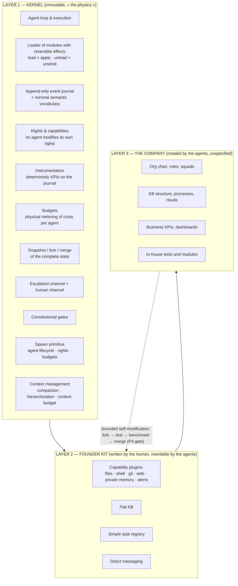
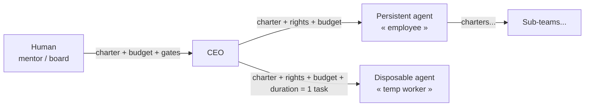
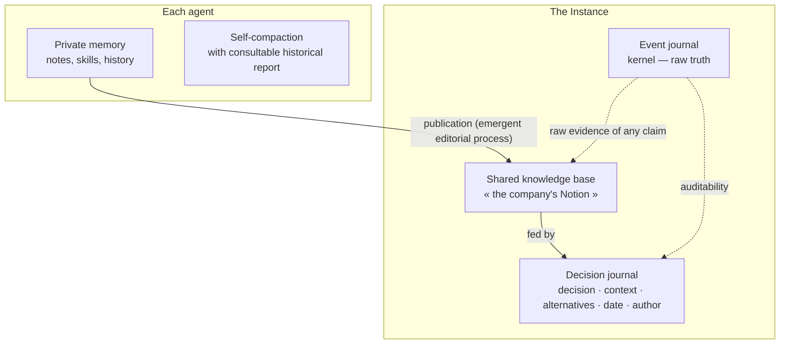
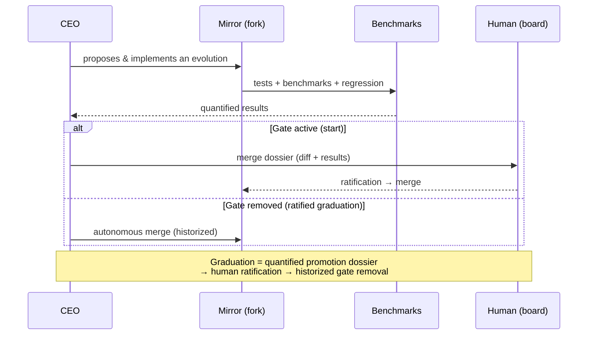

> **Historical document (pre-refocus).** The vision was refocused on 2026-09-11 (see ../vision.md); Part I of this document is deprecated. Kept for the record.

# Design — Self-evolving agentic harness

**Date:** 2026-09-09 (restructured after the Engine / Instance / Loop clarification)
**Status:** sections 1-2 validated in brainstorm; restructure validated
**Theoretical inspiration:** *A Programming Paradigm for Spatiotemporal Composability* (arXiv:2608.25512, Peking University / DeepSeek-AI) — reversible effects (temporal composability) + reactive co-effects (spatial composability), implemented in the Cordis meta-framework.

---

## How to read this document

This project contains **three distinct objects** that must never be confused (just as one does not confuse a compiler, the compiler's bootstrap process, and the programs one compiles with it):

| Object | Nature | Document |
|---|---|---|
| **The Engine** | The tool. A software artifact, domain-agnostic. | **Part I** (this spec) |
| **The Instance** | A company running on the Engine = Engine + a charter. *Data* that lives in the Engine. | **Part II** |
| **The Loop** | The author's specific use: an Instance whose mission is to improve the Engine. A *methodology*, not a feature. | **Part III** (to be detailed in a separate brainstorm) |

Critical distinction that follows from it:

- **Self-evolution** = a *runtime* feature of the Engine: agents create/modify/unload modules **hot** (layers 2/3), with reversibility. It is code; it lives in Part I.
- **Self-improvement** = a *development* process: an Instance writes code into a repo (including a possible v2 of the kernel — immutable **hot**, not **over time**), tests, benchmarks, merges. It is git, tests, gates. It lives in Part III.

When an Instance improves the Engine, it does not modify itself in flight — it does software development. The mirror/fork (§I.6) is the physical boundary between the two worlds.

---

# PART I — THE ENGINE (product spec)

## I.1 — What the Engine is

An agentic harness to which the user provides a single thing: a **charter** (mission + budget + constraints + reporting cadence). From there, a single agent — the **CEO** — builds a complete organization: it hires, structures, tools, and evolves its own environment. **The organizational structure and the software infrastructure are one and the same thing that grows.**

Hiring a CTO = mounting a module. A meeting = a coordinated transaction. A layoff = a reversible unload. The company is not *above* the harness: it **is** the harness.

### Generic promise

Any user, any domain, any mission: the Engine does not know what a software, content, or consulting company is. It knows agents, effects, events, rights, budgets.

### Product objectives, in order of priority

1. **(B) Demonstrator / research** — prove that a functional organization emerges and holds from a single agent.
2. **(C) Open-source framework** — adoptable by others, with their own charters.
3. **(A) Eventually** — real, profitable micro-companies.

## I.2 — The five founding principles

### P1 — Imposed physics, emergent organization

The immutable kernel contains only **that whose corruption is unrecoverable**: agent loop, reversible module loader, event journal, rights, recovery. **No** role, hierarchy, channel or process is coded.

| Category | Imposed? | Examples |
|---|---|---|
| **Physics** (kernel) | Yes, immutable | reversibility, rights, audit, journal, budgets, fork/merge |
| **Meaning** (instrumentation) | Yes, but these are measurements, not solutions | deterministic KPIs, health signals |
| **Organs** (organization) | Never — emergent | roles, squads, rituals, KB curator, QA |

> The Engine provides thermometers; it is the CEO who decides that it has a fever and that a doctor must be hired.

### P2 — Every effect is reversible, except what crosses the boundary of the world

Loading a module = executing effects; unloading = complete reversion (temporal composability). Irreversible external actions (email sent, payment, public publication) cross the system boundary and go through **gates**. The reversible/irreversible boundary is drawn explicitly and is part of the physics.

### P3 — The journal is the truth

An **append-only event log** with a minimal and immutable semantic vocabulary:

- `work started / finished / failed / abandoned` (who, when, cost)
- `message emitted` (from, to, channel)
- `decision recorded` (by whom, reference, alternatives)
- `module created / modified / reverted`
- `alert emitted / resolved / escalated`
- `cost consumed` (tokens, time, money)

**Carrying analogy: accounting.** Companies pivot, reorganize — but every transaction must be *accounted for*. Modules evolve freely **on condition that they speak the kernel's event vocabulary**.

Consequences:
- Deterministic KPIs that **cannot be broken** (they read the journal, never the evolving structures).
- Every KPI is **retroactively recomputable**.
- Every agent report is **auditable against the raw evidence**.

### P4 — Autonomy must be earned

- Constitutional gates at the start.
- The CEO is **master of operational decisions**; the human is **master of the constitution** (scope of autonomy).
- **Graduation on evidence**: quantified promotion dossier, human ratification.
- An agent can never remove a gate that constrains it.
- Every gate removal is historized → **traceable constitutional history**.
- The environment makes the rule real (physics); mentorship makes it understood (charter + dialogue).

### P5 — One never operates on a live system

Any modification of the system while it is running is done on a **mirror copy** (fork of the complete state), tested and benchmarked, then merged. The validation level of the merge follows P4.

> *« A faulty self-modification can disable the very process needed to recover. »* — internal reversibility protects the inside; the fork protects existence.

**Condition of the virtuous loop** (lesson of the Darwin Gödel Machine): every self-modification is validated empirically — benchmarks, regression, archive of variants, revert of regressions.

**Engine scope (Part I):** the kernel provides only the *generic capability* of snapshotting/restoring an Instance (code + data). The testing methodology (mirror fed by a copy of production, merge = code only into the repo) belongs to the usage — Part III.

## I.3 — Layered architecture

**What the kernel does not know:** neither org, nor roles, nor company.

**Provenance marking (layers 2/3):** each module carries its origin (human-bootstrap vs agent-generated) — easier revert and greater oversight over what is agent-generated.

## I.4 — The `spawn` primitive

**The kernel knows agents. Not roles, not positions.**

A role ("CTO", "sales") exists nowhere in the code: it is a **document** — a charter written by the CEO, stored in the KB. The org chart is data, not code.

**Single primitive:** `spawn(charter, rights, budget, lifetime)` → agent with private memory, inbox, budget line, lifecycle (active / suspended / revoked).

**The charter is the recursive organizational atom**: the same mechanism at every level.

**Two emergent usages:** disposable (temp worker) vs persistent (employee) — a management decision by the CEO, observable in the journal.

**Layoff = module unload**: rights revoked, records unwound, private memory archived to the KB.

### I.4bis — Recursive delegation of capabilities (the birth of hierarchy)

**Principle (capability-based security):** a right is a delegable capability, but **always in an attenuated way** — one can only transmit a subset of what one holds (scope, budget cap, headcount cap). The chain human → CEO → manager → sub-manager is merely a sequence of attenuated sub-delegations. Only the constitutional rights of agent zero are non-delegable.

**Founding consequence: the org chart is the current state of the capability-delegation graph.** There is no coded "manager role": **a manager is not a type of agent, it is an agent + a right** (an attenuated `spawn` received). Promotion = grant; layoff = revocation (= Cordis unload). No separate hierarchy system.

**The habilitation request — a single mechanism, identical at every level:**
1. **Request = proposal, not form**: the agent writes a dossier (context saturation, task queue, proposed org, requested budget) — the quantified evidence is free, provided by the instrumentation on the journal.
2. **Asking costs nothing, refusing is safe**: a refusal is a *decision recorded with its reasons* (decision journal), never a sanction; one may re-apply with a better dossier. If asking were risky, emergence would die in the egg.
3. **Silence is neither a yes nor a no**: timeout → reminder → escalation by one notch.
4. **Budget follows rights**: each spawn draws from the parent's budget — attenuation applies to money too; the company cannot grow beyond its means without human ratification.

**Emergence / framework boundary:** *when* to ask, how to structure one's teams, how many subordinates — emergent (model intelligence). The framework guarantees minimal friction: perceptible signal, single and obvious mechanism, risk-free request, traceable decision, painless refusal.

## I.5 — Memory and knowledge base

1. **Private memory per agent**: self-compaction, consultable historical reports, skills.
2. **Shared KB**: stored, ordered, transparent — decisions, trade-offs, KPIs, temporal evolution.

**KB rot is an emergent problem, not a bug to prevent.** Instrumentation makes the rot **perceptible** (contradictions, stale entries, consultation rate); it is up to the CEO to invent the solution (curator, editorial process...). Expected research result: *do we observe the emergence of a librarian?*

**The decision journal**: decision, context, rejected alternatives, date, author, reference to the evidence in the event journal.

## I.6 — Communication

**Mechanism / policy separation:**

| Level | Content | Status |
|---|---|---|
| **Mechanism** (kernel) | message bus, rights, audit log, escalation channel, human channel | Immutable |
| **Topology** (layers 2/3) | recursive groups, per-squad/project channels, granular visibility/write rights | Emergent |

The bootstrap contains only **direct messaging** (1:1). Groups, channels and rituals are invented by the org. Context isolation (no pollution between unrelated agents) is the objective of this topology — and its effectiveness is measurable in the journal.

## I.7 — Governance and growth loop

**The human is a mentor, not a conductor.** Operational → CEO is master. Constitutional → human ratifies.

### Agent zero

In the kernel, **the human is an agent like any other at the protocol level** (inbox, message bus, events) — the only one endowed with **non-delegable constitutional rights**: read everything (raw journal, KB, any channel), talk to any agent, ratify, cut the budget, stop the Instance (**physical kill switch**, functional even if all agents oppose it). These rights live in layer 1 and are the **only thing that can never be graduated** under P4.

The human may add a **companion LLM** (vocabulary↔language translation, syntheses, advice, brainstorm) — but that one is *on the human's side*, outside the chain of command: it holds **no right within the Instance**. The lawyer drafts, the client signs. Any possible intermediary between the human and the CEO is an organizational choice (emergent, reversible), never a law of the kernel; the direct bypass always exists physically.

### The cockpit

The human interface = **a chat + a web cockpit** to monitor and intervene at any level. Since everything is events, each view is a query on the journal (org chart = current spawn graph, finances = cost events, audit = raw log, health = KPIs). The cockpit is a **layer 2 module** (written by the human at bootstrap, replaceable) consuming the kernel's read/intervention APIs — just as the Koishi web console is a second Cordis application above the same kernel.

## I.8 — Hardware constraint: local model and context management

**Alpha target: Qwen3.8-27B on RTX 3090 (24 GB)** — hybrid dense 27B (48 linear-attention layers + 16 full-attention), 262k native context, adjustable thinking.

Verified points of vigilance:
- The 131k context requires a **quantized KV cache** (Q8 borderline, Q4 comfortable; FP16 does not fit alongside the Q4 weights).
- ~25-40 tok/s stock, 2×+ with speculative decoding.
- Best local agentic model to date (#7 independent, ahead of several frontier configs) but below the flagships on long-horizon reliability; scores obtained at higher precision than Q4.
- Overthinking by default → burns context.

**Design consequences:**
1. **Context management is in layer 1**: compaction, hierarchization, physically metered context budget.
2. **Multi-agent is an advantage**: N agents × 131k = extended collective working memory — if the communication topology is good.
3. **The Engine is model-agnostic**: the model is a plugin, not a foundation. Occasional escalation to frontier via API possible (under budget), future migration.
4. `reasoning_effort` set per task — emergent behavior to observe.

**Research thesis:** organizational emergence appears above a threshold of model intelligence. The whole challenge of the Engine is to lower this barrier through efficiency (prompts, memory, tooling, context management) — and self-optimization lowers it over time.

## I.9 — Evaluation: two axes

### Axis 1 (primary, research) — Organizational convergence and plasticity

The question is not only "does a social model converge?" but: **is the organization *plastic* — capable of leaving a stable state, re-exploring on each new directive from the board, and reconverging without chaos or paralysis?** (Continuous exploration/exploitation cycles, unlike the single cooling of RL.)

**Instrumentation (all metrics are time series computed on the journal):**

| Signal | Healthy convergence | Failure |
|---|---|---|
| Role Stability Index(t) | rises then plateaus | plateau near 0 (permanent role churn) |
| Hierarchical depth(t) | grows with complexity then plateaus | frozen at 1 or unstable |
| Trophic Incoherence(t) | falls then plateaus (coherent hierarchy) | ≥ 1 (directionality lost) |
| Gap between norm acceptance/compliance | closes | norms accepted but never applied (convergence theater) |
| Deliberation diversity | non-zero at the plateau | collapse (echo chamber) |
| Ratio of coordination / production tokens | plateaus low | the org suffocates in its own meetings |

**Step-response (the experimental gift):** each directive from agent zero is a timestamped event in the journal → each strategic decision is a *free controlled intervention* (before/after event study). For each shock: **relaxation time** (delay to re-stabilize — too long = ossification), **overshoot** (oscillations/chaos — perpetual reorganization), **quality of the new plateau** (suited to the new direction?). The two diseases to detect: **ossification** (can no longer explore) and **perpetual reorganization** (can no longer exploit).

**Anti-Goodhart rule (crucial):** the convergence metrics are observation instruments for agent zero and for research — **never visible or optimizable by the agents**. Otherwise the CEO would freeze its roles to "raise the score" (reward hacking).

### Axis 2 (secondary) — Value produced

Declared by charter: objective mission proxies (for M1: trajectory of the Engine's tests/benchmarks, rate of merged improvements) + periodic board reviews. An org that converges but produces nothing remains a useful failure to document.

### Reference metric of thesis B — the emergence dividend

**Same mission, same model, same token budget: solo agent vs emerged org.** If the org produces more at an equal budget, emergence is demonstrated quantitatively. Fine-grained variant: the *marginal value of the N-th agent*.

### Health indicators of the principles (physics)

| Principle | Indicators |
|---|---|
| P2 Reversibility | rate of successful reverts, orphaned rights, state leaks after unload |
| P3 Journal = truth | % of conforming events, claims verifiable against raw evidence |
| P4 Earned autonomy | graduations, merges without revert, benchmark deltas |
| P5 Never live | % of modifications that went through the mirror (target 100 %) |

## I.10 — Alpha scope (YAGNI)

**To build:** the physics + the senses + the founder kit + the charter. Nothing else.

**Founder kit (decided):** basic capabilities (files, shell, git, web, private memory, alerts) + **the delegation machine** (kernel `spawn` + simple task registry + direct messaging + journal) + flat KB. **Zero business tools**: business tooling is a *production of the company* (the CEO does not code — it hires those who code), or later an emergent marketplace (M3). The quality of delegation is taught by the charter letter and mentorship, not by more tools (Anthropic lesson: vague briefs are the documented failure, not the lack of tooling). State of the art: consensus on the manager's minimal action space (AOrchestra: `Delegate` + `Finish`; CrewAI: "the manager has no tools, it only delegates"; business tooling in the platform layer, not in the agent's context — Paperclip, OMC).

**Not in scope:** marketplace, fine-tuning, BUs, SaaS (agents' production, not code); communication topology, roles, rituals (emergent); dedicated observers (emergent roles — the kernel provides senses + escalation, not anatomy).

---

# PART II — THE INSTANCE (what a company running on the Engine is)

*(Section to be completed — the open questions are listed in §IV.)*

An **Instance** = the Engine + a **charter** + an initial state (founder kit). It is data that lives in the Engine.

**Lifecycle of an Instance:** creation (charter + initial budget) → operation (agent loop + reporting) → progressive graduation (P4) → possibly: suspension, fork, or shutdown.

**The charter** is the only input. It **is born from a conversation** (the interface is the chat), then **crystallizes into a contract** versioned in the journal:

- **Machine envelope**: budget, gates, reporting cadence, limits — applied by the kernel's physics, never negotiable by the CEO.
- **Letter in natural language**: mission, values, tone, mentor expectations — interpreted by the CEO, revisable by re-discussing.

> Discussion is the process; the charter is the signed act. A conversation is forgotten and reinterpreted; a company needs a consultable founding act.

The same structure reproduces recursively at each `spawn`: the envelope becomes rights + budget, the letter becomes the job description.

**Multi-instances:** the Engine must allow several independent Instances to run (isolation = realms in the Cordis manner) — including the mirror Instance used for Engine development (Part III).

---

# PART III — THE LOOP (self-improvement program — the author's usage)

*(Section to be detailed in a separate brainstorm, once Part I is frozen.)*

**Principle:** the author creates an Instance ("Framework Corp") whose charter is: *maintain and improve the Engine*. Framework Corp is its own demo, its own benchmark, its own client (dogfooding).

**The Loop is software development, not self-modification in flight:** Framework Corp works in a repo, on a mirror of itself (dev Instance), with tests, benchmarks, and merges subject to the gates (P4/P5). The kernel never changes hot; a v2 of the kernel can be *developed* like any other software.

**Envisaged milestones:**
- **M1**: Framework Corp maintains and improves the Engine (the real test: does velocity increase? does revert churn decrease? does the org emerge?).
- **M2**: Framework Corp builds a SaaS based on the Engine (first irreversible actions at scale — the P2 boundary becomes critical).
- **M3**: growth — BUs, R&D, marketplace, fine-tuning...

**Graduation:** as ratified promotion dossiers accumulate, the gates are removed (e.g. target: autonomous merge into the production Engine).

**Mirror methodology (decided):** the test mirror = snapshot of **code + copy of the data** of Framework Corp (KB, journal, config) — to test "does my existing company survive the v2?" without repaying a cold-start at each test. The **merge into the open-source repo = code only**: the Instance's universe (memory, org chart, journal) remains its private property; the mirror's journal is archived as an appendix, never merged nor falsified (P3). No checkpointing of live agents (too complex for the alpha; agents must be reconstructible from journal + KB).

**Research axis — abnormal behavior detection (human side, never an automatic judge):** "divergence from intention" is badly posed (emergence *is* a legitimate divergence; Goodhart). What is well posed: reconciliation of declared vs physical trace (deterministic), unsupervised anomaly detection on the trace (communication topology, costs, semantic silences), LLM auditor on a *heterogeneous* model, and verifiable explanations ("explain this activity spike" confronted with the raw evidence). Signals for the cockpit/companion, never automated sanction.

---

# PART IV — Open questions and risks

## Open questions (before implementation)

1. ~~Exact format of the charter~~ → **resolved**: conversation → crystallization (machine envelope + letter), §II + agent zero/cockpit §I.7.
2. ~~Event vocabulary~~ → **resolved**: declarative verbs with a constrained shape (one id, one emitter, one start, a single end, a cost) + native physical trace of the kernel (acting = emitting) + declared/physical reconciliation; semantic silence is a signal.
3. ~~State fork/merge mechanism~~ → **resolved**: kernel = generic snapshot/restoration (§I.2 P5); code+data methodology / code-only merge (§III).
4. ~~Measurement of the value produced~~ → **resolved**: two-axis evaluation (convergence/plasticity primary, value secondary) + emergence dividend + anti-Goodhart rule (§I.9).
5. ~~Content of the founder kit~~ → **resolved**: capabilities + delegation machine + flat KB, zero business tools (§I.10).

## Identified risks

| Risk | Treatment |
|---|---|
| Fatal self-modification | Sanctified kernel + mirror + merge gate (P1, P5) |
| Silent KB rot | Instrumentation that makes it perceptible; expected emergent curator |
| Cost / context explosion (n² communication) | Physical budgets per agent + measured emergent topology |
| Telephone game in reports | Journal = accessible raw evidence; auditability |
| Correlated blind spots (same model everywhere) | Possible heterogeneous models (model plugin); human audit |
| Cold-start too cold | Founder kit + well-written charter + active mentorship |
| Local model below the emergence threshold | Model-agnostic Engine; API escalation; measuring the failure is a result |
| Value produced not measurable | Open question §IV.4 |

---

## References

- *A Programming Paradigm for Spatiotemporal Composability* — arXiv:2608.25512 (Peking University / DeepSeek-AI, August 2026)
- DeepSeek Harness (`deepseek-ai/deepseek-harness`) — Developer Preview v0.1, August 2026
- Cordis / Koishi — plugin meta-framework, 4 000+ community plugins
- Paperclip (`paperclipai/paperclip`) — org-chart control plane (2026)
- OneManCompany (OMC) — arXiv:2604.22446 (2026)
- Darwin Gödel Machine — arXiv:2505.22954 (2025)
- *Drop the Hierarchy and Roles* — arXiv:2603.28990 (2026)
- TheAgentCompany — arXiv:2412.14161 (2024)
- ChatDev — arXiv:2307.07924 · MetaGPT — arXiv:2308.00352 (2023)
- Qwen3.8-27B — huggingface.co/Qwen/Qwen3.8-27B (August 2026) ; Artificial Analysis (Sept. 2026)
- *From Solo Control to Enterprise Scale: A Survey of One-Person Agentic Company* — preprints.org/manuscript/202608.1414 (August 2026)
